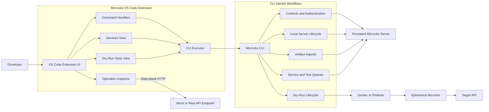
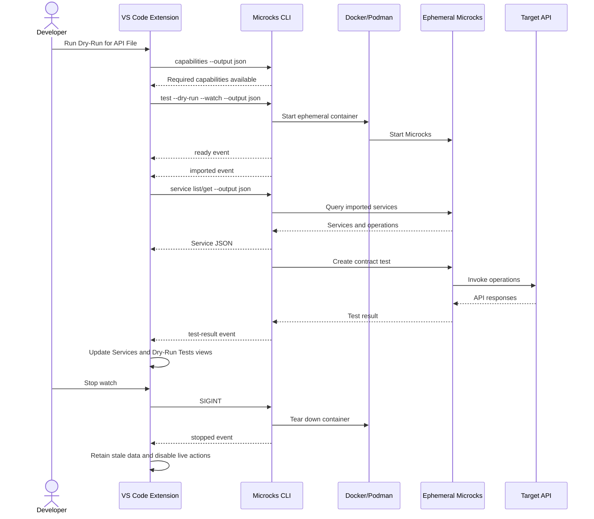
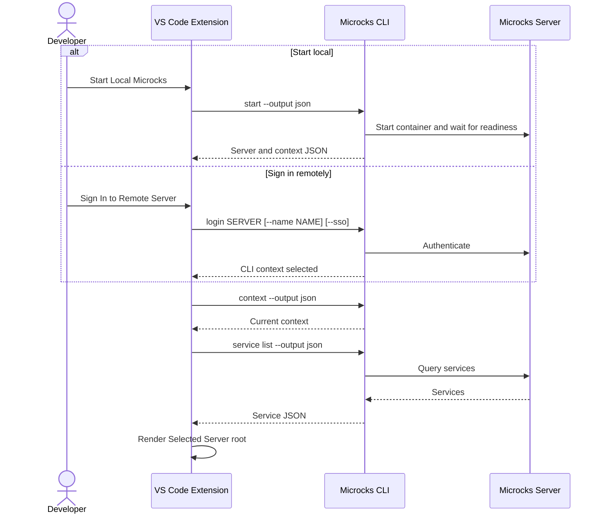
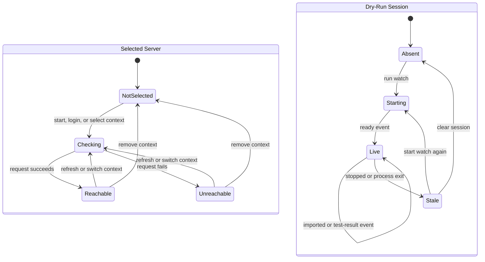

# Microcks VS Code Extension Architecture

The Microcks VS Code extension is a CLI-first editor integration. The extension
owns the VS Code experience while the Microcks CLI owns Microcks control-plane
workflows such as authentication, context selection, imports, server lifecycle,
service and test queries, and dry-run execution.

This boundary keeps command behavior reusable across the terminal, CI systems,
and editor integrations. It also prevents the extension from maintaining a
second authentication and configuration implementation.

## Runtime Requirements

The extension can activate and display its views without a Microcks server or
CLI. A compatible CLI is required when the user starts a Microcks workflow.

| Workflow | Compatible CLI | Existing Microcks server | Docker or Podman | Target API |
| --- | ---: | ---: | ---: | ---: |
| Open the extension and view recovery actions | No | No | No | No |
| Run a one-shot or watched dry-run | Yes | No | Yes | Yes |
| Start local Microcks | Yes | No | Yes | No |
| Connect to remote Microcks | Yes | Yes | No | No |
| Browse connected services and tests | Yes | Yes | No | No |
| Invoke a discovered mock | Yes for discovery | Yes | No | No |

"Without a server" means without an already-running Microcks server. A dry-run
still needs the CLI, a container runtime, an API artifact, and a real target API
to test. The CLI creates an ephemeral Microcks instance for the duration of the
dry-run.

The extension resolves the CLI in this order:

1. A user-configured `microcks.cliPath`.
2. A compatible CLI installed into extension-managed storage.
3. `microcks` available on `PATH`.

`microcks.cliPath` selects a program the extension executes, so it is declared
`machine` scoped and listed under
`capabilities.untrustedWorkspaces.restrictedConfigurations`. `cliResolver`
reads it through `WorkspaceConfiguration.inspect` and uses the global value
only, so a path written by an opened repository never reaches `spawn` even if a
host merged it. A workspace or folder value that was dropped is reported back
to the user instead of being silently discarded.

Every CLI invocation goes through `executeMicrocksCli`, which refuses to spawn
while the window is in restricted mode; the dry-run watch process, which spawns
the CLI directly, repeats the same check. `MicrocksWorkspaceTrustError` drives
the restricted-mode rows in both trees, and
`workspace.onDidGrantWorkspaceTrust` refreshes them once the folder is trusted.

The extension checks `microcks capabilities --output json` before relying on a
machine-readable contract. A missing or incompatible CLI does not prevent the
extension from activating; the views remain available with install, update, and
path-selection recovery actions.

## Responsibility Boundary

### Extension-owned responsibilities

- VS Code commands, views, tree state, notifications, and status bar state.
- Connected-server and dry-run-session presentation.
- Operation Inspector request and response presentation.
- Direct data-plane invocation of mock and real API endpoints.
- CLI discovery, compatibility checks, and prompted managed installation.

### CLI-owned responsibilities

- Authentication and token refresh.
- Context creation, selection, listing, and deletion.
- Local Microcks container lifecycle.
- Artifact import.
- Service and test result queries.
- Dry-run execution, watch behavior, and ephemeral container lifecycle.
- Stable exit-code classification and machine-readable output contracts.

The extension does not read credentials from the CLI configuration file and
does not fall back to the Microcks management REST API. Direct HTTP remains
appropriate in the Operation Inspector because invoking a mock or real endpoint
is a data-plane editor action rather than a Microcks control-plane operation.

## Overall Architecture



## Machine-Readable Output

The CLI uses different output mechanisms for different shapes of data.

### Completed test results

A completed test result continues to use the existing formatter abstraction:

```text
TestResult -> Formatter -> text | json | yaml | github-actions
```

The formatter is appropriate here because each format represents the same
completed `TestResult` domain object.

### Other domain commands

Contexts, capabilities, services, imports, and test-result queries expose other
domain models. These commands use the shared `output.WriteJSON` helper instead
of forcing unrelated values through the test-result formatter.

Examples include:

- `microcks capabilities --output json`
- `microcks context --output json`
- `microcks start --output json`
- `microcks import <artifact> --output json`
- `microcks service list --output json`
- `microcks service get --output json`

### Dry-run watch events

Watch mode is long-running and cannot wait for one final JSON document. It
therefore emits newline-delimited JSON events:

```text
ready -> imported -> test-result -> waiting -> ... -> stopped
```

Each line is an independent JSON document. Human progress and diagnostics are
written to stderr, leaving stdout as a valid event stream. The event types are:

| Event | Meaning |
| --- | --- |
| `ready` | The ephemeral Microcks server is reachable. |
| `imported` | The API artifact is available in ephemeral Microcks. |
| `test-result` | A completed contract-test result is available. |
| `waiting` | Watch mode is waiting for the artifact to change. |
| `error` | A recoverable watch or test error occurred. |
| `stopped` | Watch mode and the ephemeral session have stopped. |

A reusable NDJSON writer could be introduced if additional CLI commands adopt
event streams. For the current single streaming contract, the dry-run writer
keeps the implementation local to the workflow.

## Dry-Run Without An Existing Server



The extension presents the ephemeral environment under a dedicated **Dry-Run
Session** root. When the process stops, cached services and test results remain
visible, but actions that require the stopped server are disabled.

## Selected Server Workflow



The selected CLI context backs the **Selected Server** root in the Services
view. A saved context is configuration, not proof of connectivity. The tree
starts in `checking` state and reports `reachable` only after its CLI query
succeeds. Switching contexts updates the root and the active-context status bar.

The **Dry-Run Tests** view is not context-backed. It renders only what a
dry-run watch session streams back, so expanding a run reads details already
held in memory rather than issuing a CLI query, and its service filter is
applied client-side. Browsing test runs stored on a connected server is
deferred — `microcks test list` targets `GET /api/tests`, which Microcks
answers with HTTP 405; see "Deferred" in the README.

## State Model

The selected server and dry-run session are independent states:



This separation prevents a dry-run from overwriting the persistent selected
context and prevents stale mock URLs from being presented as live endpoints.
